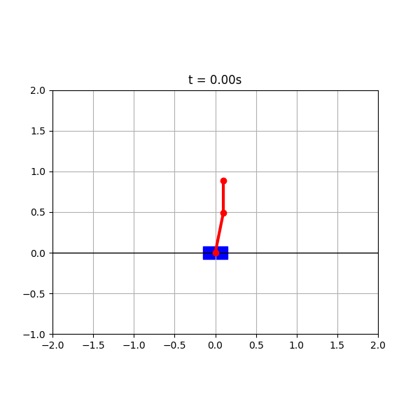

# N-Link Inverted Pendulum Control



## Overview

This is an implementation of nonlinear dynamics, state estimation, and optimal control for an N-link inverted pendulum on a cart.

Supports an arbitrary numbers of links, full nonlinear simulation, LQR and MPC controllers  and a discrete-time Kalman filter for state estimation.

## Theory

### Dynamics
The equations of motion are derived using the Lagrangian formulation. The mass matrix M(q) and generalized forces f(q, q̇) are computed symbolically for N links, giving:
```
M(q)q̈ = f(q, q̇) + Bu
```

The system is integrated using a 4th-order Runge-Kutta method.

### Linearization and Discretization
The nonlinear dynamics are linearized numerically via central differences around the upright equilibrium, producing a continuous-time LTI system (A, B). Zero-Order Hold (ZOH) discretization via matrix exponential gives the discrete system (Ad, Bd).

### LQR
Linear Quadratic Regulator solves the Discrete Algebraic Riccati Equation (DARE) to compute the optimal state feedback gain K minimizing:
```
J = Σ xᵀQx + uᵀRu
```

### MPC
Model Predictive Control solves a constrained finite-horizon optimization problem at each timestep using CasADi and IPOPT:
```
minimize    Σ xᵀQx + uᵀRu + xₙᵀPxₙ
subject to  x[k+1] = Ad·x[k] + Bd·u[k]
            u_min ≤ u ≤ u_max
```

The terminal cost P is the LQR cost-to-go, guaranteeing stability.

### Kalman Filter
A discrete-time Kalman filter runs predict/update steps to estimate the full state from noisy measurements.

## Project Structure
```
n_link_pendulum/
├── dynamics/
│   └── pendulum.py        # Lagrangian dynamics, RK4, linearization, ZOH
├── control/
│   ├── lqr.py             # LQR via DARE
│   └── mpc.py             # MPC via CasADi + IPOPT
├── estimation/
│   └── kalman.py          # Discrete-time Kalman filter
├── simulation/
│   └── simulator.py       # Simulation loop
├── utils/
│   └── viz.py             # Matplotlib animation and plots
├── results/               # Output gifs and plots
└── requirements.txt
```

## Installation
```bash
git clone git@github.com:SteppenGolf/n-link-pendulum.git
cd n-link-pendulum
python3 -m venv venv
source venv/bin/activate
pip install -r requirements.txt
```

## Usage

### Run LQR simulation and visualize
```bash
python3 utils/viz.py
```

### Run MPC controller
```bash
python3 control/mpc.py
```

### Test dynamics
```bash
python3 dynamics/pendulum.py
```

## Results

The LQR controller successfully stabilizes a 2-link pendulum from an initial angle of 0.2 rad. The MPC controller handles input constraints (|u| ≤ 20 N) while achieving stabilization with a horizon of N=20 steps.

| Controller | Initial Angle | Steps to Stabilize | Input Constraints |
|------------|--------------|-------------------|-------------------|
| LQR        | 0.2 rad      | ~200              | None              |
| MPC        | 0.05 rad     | ~300              | ±20 N             |

## Future Work

- Event-triggered control — reduce computation by only updating when state error exceeds a threshold
- Gaussian Process augmentation for learning model uncertainty online
- Distributed MPC for coupled multi-pendulum systems
